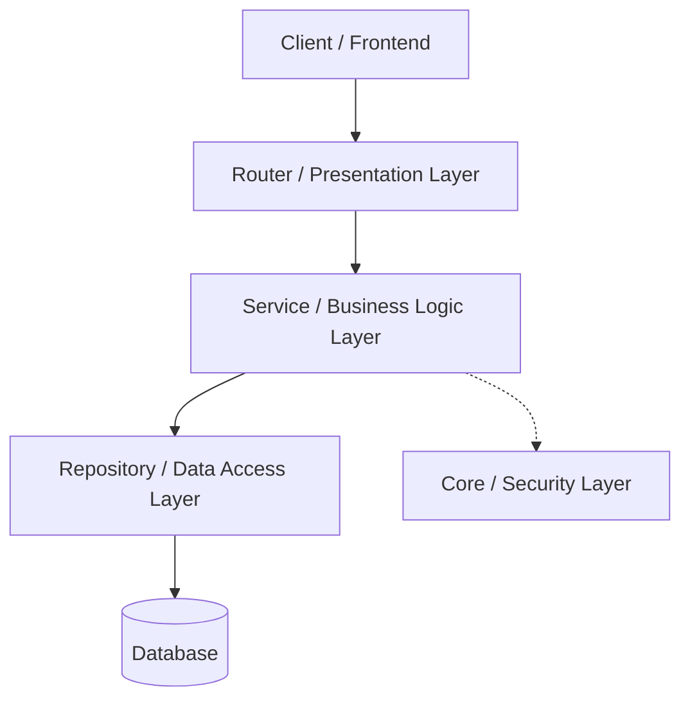

# System Architecture

## Overview
The application follows a **Modular, Layered Architecture** inspired by Domain-Driven Design (DDD). This ensures separation of concerns, testability, and scalability. The core framework is **FastAPI**, backed by **SQLAlchemy** for ORM and **Pydantic** for data validation.

## Architectural Layers

### 1. Presentation Layer (`app/routers`)
- **Responsibility**: Handles HTTP requests/responses, status codes, and input validation.
- **Key Components**: `auth.py`, `transactions.py`, `goals.py`, `households.py`.
- **Validation**: Uses Pydantic models from `app/schemas.py`.

### 2. Business Logic Layer (`app/services`)
- **Responsibility**: Contains "pure" business rules. It does not know about HTTP.
- **Key Logic**:
    - **AllocationService**: Calculates future cash flow.
    - **GoalService**: Determines goal health indices.
    - **SecurityService**: Handles ownership and permission checks (e.g., "Is user X admin of household Y?").

### 3. Data Access Layer (`app/repositories`)
- **Responsibility**: Abducts raw database operations.
- **Pattern**: Repository Pattern (e.g., `BaseRepository`).
- **Benefit**: Allows easy swapping of the underlying database or mocking for tests.

### 4. Data Layer (`app/models.py`)
- **Technology**: SQLAlchemy (ORM).
- **Flexibility**: Configurable for **SQLite** (Dev/Local) and **PostgreSQL** (Prod).

## Extensibility
The modular design makes extending the app straightforward:
- **Adding a "Crypto" Domain**:
    1.  Create `Category` for it (if needed).
    2.  Add `models.CryptoAsset`.
    3.  Create `repositories/crypto.py`.
    4.  Create `services/crypto_service.py`.
    5.  Expose via `routers/crypto.py`.

## API Design
- **Standard**: RESTful.
- **Auth**: Bearer Token (JWT).
- **Documentation**: Auto-generated Swagger UI (`/docs`).

## Feedback & Improvements

### 1. Concurrency (Immediate Win)
- **Current State**: Synchronous `Session` database operations.
- **Improvement**: Migrate to `AsyncSession` (SQLAlchemy 1.4+). FastAPI is natively async; synchronous DB calls block the main thread, reducing throughput under load.

### 2. Caching Strategy
- **Issue**: Dashboard and Statistics endpoints recalculate aggregations on every request.
- **Improvement**: Implement **Redis** caching for heavy read endpoints (e.g., `get_dashboard_stats`). Invalidate cache on Transaction create/update.

### 3. Background Tasks
- **Issue**: Heavy operations (like bulk syncing 1000s of transactions to goals) run in the request cycle.
- **Improvement**: Integrate **Celery** or **ARQ** for background processing (e.g., "Email Weekly Report").

### 4. Database Migrations
- **Observation**: `Base.metadata.create_all` is often used for dev.
- **Recommendation**: Formalize **Alembic** for managing schema migrations to ensure safe production updates.
